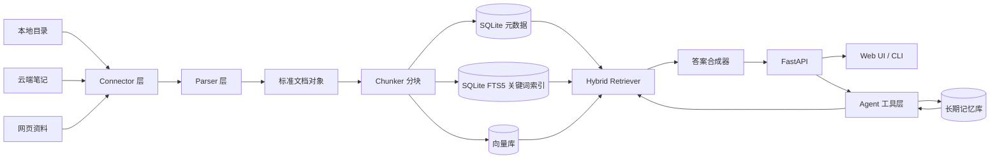

# Personal Wiki Agent 完整设计方案

## 1. 文档目的

本文档描述 Personal Wiki Agent 的完整设计方案，用于指导后续项目实现、技术选型、工期排布和演进决策。

本文档不是替代 [technical-direction.md](technical-direction.md)。两者分工如下：

- [technical-direction.md](technical-direction.md)：记录项目方向、技术路线和防跑偏原则，是路线决策的 source of truth。
- 本文档：把路线落成可执行的系统设计、模块拆分、技术选型、迭代计划和验收标准。

如果未来技术方向发生变化，应先更新 [technical-direction.md](technical-direction.md)，再同步修改本文档。

## 2. 最终产品形态

Personal Wiki Agent 的最终形态是一个本地优先、可持续学习、可主动协作的个人 second brain Agent。

它应能整合以下信息来源：

- PC 本地知识目录：PDF、Markdown、txt、docx、HTML、代码说明文档、课程资料、下载资料、归档文件等。
- 笔记 App 本地数据或同步目录：Obsidian vault、有道云笔记本地缓存、语雀导出目录、同步到本机的 Markdown / HTML / PDF 等。
- 云端笔记：Notion、飞书、语雀、有道云笔记、OneNote、Apple Notes 等。
- 网络知识来源：Internet 网页、公众号文章、网页剪藏、书签、稍后读内容、复制保存的文章片段。
- 长期记忆：用户偏好、项目背景、历史对话中沉淀的稳定信息。

它应能提供以下能力：

- 像搜索引擎一样找到资料。
- 像研究助理一样总结资料。
- 像知识管理工具一样关联主题。
- 像个人 Agent 一样记住长期偏好和项目上下文。
- 像自动化助手一样定期提醒、生成 digest、发现待整理内容。

第一阶段不追求“大而全”，先完成一个本地优先的可靠 MVP。

### 2.1 主要需求来源

本项目面向持续学习者和长期知识积累者。

这类用户的知识不是一次性导入的，而是在日常学习和工作中持续产生、持续收集、持续变化：

- 从 PC 本地目录持续增加资料。
- 从网页、公众号、课程、电子书和项目资料中摘录知识。
- 将资料保存到 Notion、有道云笔记、语雀、Obsidian 等笔记系统。
- 通过云端同步或导出机制，让部分笔记以本地文件形式存在于 PC 上。
- 在与 Agent 的长期协作中不断形成新的偏好、项目背景和整理规则。

因此，系统设计必须支持“持续补充、持续同步、持续索引、持续理解”，而不是只做一次性导入。

## 3. 设计原则

### 3.1 本地优先

默认所有资料、索引、缓存、长期记忆都存储在本机。

只有用户显式配置云端笔记 token、云端模型 API key 或远程同步目标时，系统才访问外部服务。

本地优先并不排斥云端笔记。系统应优先利用本地目录、本地同步目录和本地缓存完成知识库闭环；当本地同步目录无法覆盖需求时，再通过云端 connector 接入。

### 3.2 小核心，大扩展

核心系统只负责稳定的知识库闭环：

```text
扫描资料 -> 解析文档 -> 分块索引 -> 混合检索 -> 带引用回答
```

其他能力通过 connector、parser、retriever、agent tool、memory provider 等接口扩展。

### 3.3 文档知识库与长期记忆分离

文档知识库记录事实资料，必须可追溯到来源。

长期记忆记录 Agent 对用户的理解，不一定来自单个文件，但必须标记来源、置信度和更新时间。

两者可以在回答时共同参与检索，但不能混存为一个不可解释的黑箱。

详细的存储、索引、检索、上下文合成和性能策略见 [knowledge-memory-separation.md](knowledge-memory-separation.md)。

### 3.4 Hybrid Search 是默认检索策略

中文个人知识库不能只依赖向量检索。

默认检索应同时使用：

- 关键词检索：标题、人名、术语、原文定位。
- 向量检索：语义相近、模糊表达、跨语言表达。
- 元数据过滤：目录、来源、时间、标签、文件类型。
- rerank：后续阶段用于提升排序质量。

### 3.5 来源引用优先

所有知识库回答都应尽量包含来源引用。

如果答案来自长期记忆，应标记为记忆。

如果答案来自模型常识或推断，应明确说明没有找到直接来源。

### 3.6 不被框架牵着走

LlamaIndex、LangChain、Quivr 等可以参考或局部使用，但核心数据流和接口边界应由本项目控制。

不要让外部框架决定产品形态。

### 3.7 持续学习可解释

本项目中的持续学习，优先指知识库和长期记忆的持续更新，而不是对大模型进行持续训练。

MVP 阶段的持续学习包括：

- 监听或定期扫描多个本地知识目录。
- 检测文件新增、修改、删除和移动。
- 对变化内容增量解析、分块和索引。
- 将用户确认的偏好、项目背景和稳定事实写入长期记忆。

后续阶段的持续学习包括：

- 自动摘要新增资料。
- 自动生成标签和主题关联。
- 根据用户查询和反馈优化检索排序。
- 发现重复主题、未整理资料和长期未更新主题。
- 对长期记忆进行冲突检测、合并和过期处理。

### 3.8 可迁移与云端同步互补

个人知识库必须考虑换电脑、重装系统、硬盘损坏和长期备份。

本地 PC 适合作为高性能索引、缓存、隐私资料和离线处理环境；云端笔记 App 更适合作为跨设备同步、长期保存和换机恢复的稳定载体。

因此系统应区分几类资料状态：

- `local_only`：只存在于本地 PC 的资料，例如下载的 PDF、课程文件、临时项目资料。
- `local_synced`：由笔记 App 同步到本机的资料，例如 Obsidian vault、云笔记本地缓存或导出目录。
- `cloud_backed`：云端笔记是主副本，本地只保存索引、缓存和必要元数据。
- `cloud_mirror`：本地资料被用户显式归档或镜像到某个云端笔记知识库。

换电脑时的理想流程：

1. 用户在新电脑登录云端笔记 App，同步 Notion、语雀、有道云笔记、飞书、Obsidian sync 等内容。
2. 用户恢复或重新配置本地知识目录。
3. Personal Wiki Agent 重新扫描本地同步目录和云端 connector。
4. 本地 SQLite、FTS、向量索引和缓存可以重建，不作为唯一主副本。
5. 长期记忆、配置和用户确认的整理结果需要支持导出、备份和迁移。

本地资料可以被整理、摘要或归档到云端笔记，但必须由用户显式触发或确认，不能默认自动上传。

## 4. 参考项目取舍


### 4.1 Khoj：产品体验参考

参考内容：

- 个人 second brain 定位。
- 自托管和本地使用体验。
- custom agent。
- 个人资料问答和自动化。

不直接照搬：

- 不 fork Khoj。
- 不一开始复制它的完整功能面。
- 不在 MVP 阶段做多入口客户端。

### 4.2 Onyx：架构参考

参考内容：

- connector 抽象。
- 后台同步任务。
- hybrid search。
- 数据源模型和权限字段。
- 后续 MCP / action 扩展思路。

不直接照搬：

- 不在 MVP 阶段做企业级部署。
- 不做复杂组织、团队、RBAC。
- 不引入过重的微服务架构。

### 4.3 Quivr：RAG 细节参考

参考内容：

- parser、chunk、retriever、vectorstore 的边界。
- 文件问答流程。
- RAG 组件可替换设计。

不直接照搬：

- 不把项目做成纯 RAG SDK。
- 不只关注文件问答，忽视个人 Agent 和长期记忆。

### 4.4 Mem0：长期记忆参考

参考内容：

- 用户记忆、会话记忆、Agent 记忆分层。
- 记忆的增删改查。
- 记忆召回和个性化回答。

不直接照搬：

- 不把文档知识库塞进 memory。
- MVP 先自建最小 memory 表，后续再决定是否接入 Mem0 或兼容其接口。

## 5. 总体架构



系统分为九层：

1. 数据源层：本地目录、云端笔记、网页资料。
2. Connector 层：统一同步不同数据源。
3. Parser 层：把不同格式解析为文本。
4. 标准文档层：统一 Document / Chunk / Source 模型。
5. 索引层：关键词索引、向量索引、元数据索引。
6. 检索层：hybrid search、过滤、排序、rerank。
7. 回答层：上下文构造、答案生成、来源引用。
8. Agent 层：工具调用、任务拆解、长期记忆。
9. 交互层：Web UI、CLI、后续桌面端。

### 5.1 架构成熟度说明

这九层不是一次性 MVP 临时架构，而是项目的长期目标架构骨架。

MVP 要做的是在这套目标架构上实现一条最短可用的垂直链路：

```text
本地目录 / 本地同步笔记目录
-> Connector
-> Parser
-> Document / Chunk
-> 关键词索引 + 向量索引接口
-> Hybrid Retriever
-> 带引用回答
-> 最小 Agent 工具
-> CLI 或 Web UI
```

后续成熟化时，应优先在既有层内扩展能力，而不是推翻分层：

- 新增 Notion、飞书、语雀、有道云笔记：扩展 Connector 层。
- 新增 OCR、复杂 PDF、图片理解：扩展 Parser 层。
- 替换 Chroma / LanceDB / Qdrant / sqlite-vec：扩展索引层的 `VectorStore` 实现。
- 引入 rerank、中文分词、检索评测：扩展检索层。
- 增强 custom agent、自动 digest、主题地图：扩展 Agent 层。
- 从 Web UI 扩展到桌面端：扩展交互层。

这意味着第一版可以功能少，但边界不能乱。MVP 代码也应按这些层次组织，避免把扫描、解析、检索、回答和 UI 混在一起。

### 5.2 稳定边界

以下边界应保持长期稳定：

- 数据源必须通过 Connector 接入。
- 不同文件格式必须通过 Parser 转成标准文档对象。
- 文档知识库必须使用 Document / Chunk / Source 模型。
- 文档知识库与长期记忆必须分离。
- 检索必须保留 hybrid search 架构位置。
- Agent 必须通过工具层访问检索、记忆和同步能力。
- 回答必须保留来源引用能力。

以下内容可以随着阶段演进替换或增强：

- 具体向量数据库。
- 具体 embedding 模型。
- 具体 LLM provider。
- 具体云端笔记平台。
- 具体 UI 技术栈。
- 具体 reranker 或中文分词方案。

## 6. 核心数据流

### 6.1 索引流程

```text
读取配置 -> 扫描多个数据源 -> 判断新增/更新/删除/移动 -> 解析文档 -> 清洗文本 -> 分块 -> 写入元数据 -> 写入关键词索引 -> 写入向量索引 -> 更新同步状态
```

索引流程必须支持增量更新：

- 文件路径不变但修改时间变化：重新解析并更新 chunk。
- 文件删除：标记为 deleted 或从索引移除。
- 文件移动：通过 content hash 尽量识别为移动而不是全新文件。
- 云端笔记更新：通过 remote updated_at 或 revision 判断是否同步。
- 笔记 App 本地同步目录变化：按普通本地目录处理，但保留来源类型和笔记 App 元数据。

### 6.2 问答流程

```text
用户问题 -> 查询理解 -> 元数据过滤 -> 关键词召回 -> 向量召回 -> 结果合并 -> 排序 -> 构造上下文 -> LLM 生成 -> 来源引用
```

回答输出至少包含：

- answer：回答正文。
- citations：来源列表。
- confidence：答案可信度估计。
- retrieval_summary：检索摘要，便于调试。

### 6.3 Agent 工具流程

Agent 不直接访问底层数据库，而是通过稳定工具接口工作：

- `search_notes`：检索相关笔记和文档。
- `open_source`：打开或读取具体来源。
- `summarize_folder`：总结某个目录或数据源。
- `build_topic_map`：围绕主题建立资料地图。
- `remember_preference`：记录用户稳定偏好。
- `search_memory`：检索长期记忆。

## 7. 技术选型

### 7.1 后端

默认选型：

- Python 3.11 或更高版本。
- FastAPI。
- Pydantic。
- SQLAlchemy。
- Alembic。

选择原因：

- Python 在文档解析、RAG、向量库、LLM SDK 生态上更成熟。
- FastAPI 适合快速提供本地 API，也方便未来接 Web UI、CLI、桌面端。
- Pydantic 适合定义清晰的数据模型。
- SQLAlchemy + Alembic 有利于数据库 schema 演进。

优势：

- MVP 开发快。
- 本地运行门槛低。
- 后续可扩展为服务端部署。

### 7.2 元数据存储

默认选型：

- SQLite。

存储内容：

- 数据源配置状态。
- 文档元数据。
- chunk 元数据。
- 索引任务状态。
- 长期记忆。
- 对话记录摘要。

选择原因：

- 本地优先项目不需要一开始引入 PostgreSQL。
- SQLite 文件易备份、易迁移、易调试。
- 后续可通过 repository 层迁移到 PostgreSQL。

优势：

- 简单稳定。
- 适合个人项目。
- 不需要额外服务。

### 7.3 关键词检索

默认选型：

- MVP 使用 SQLite FTS5 作为第一版关键词索引实现。
- 通过 `LexicalIndex` 接口隔离具体搜索引擎。
- 不在业务层直接绑定 FTS5。

选择原因：

- 和 SQLite 元数据存储自然配合。
- 支持本地全文检索。
- 对文件名、标题、术语、人名、原文定位很有效。
- 不需要额外搜索服务，适合本地优先 MVP。

性能边界：

- SQLite FTS5 适合个人知识库 MVP 和中小规模本地资料。
- 如果 chunk 数量达到几十万级，或需要更强中文分词、字段权重、模糊匹配、查询分析，应评估 Tantivy、Meilisearch 或 OpenSearch。
- FTS5 是低成本起点，不是长期绑定。

接口抽象：

```text
LexicalIndex
  SQLiteFtsIndex
  TantivyIndex
  MeilisearchIndex
  OpenSearchIndex
```

业务层只依赖 `LexicalIndex`，不直接写 FTS5 查询。

注意事项：

- 中文分词需要单独处理。
- 文档分块不能过碎，否则会导致索引膨胀。
- 标题、文件名、路径、正文 chunk 应有不同权重。
- 文件变化只更新对应 document / chunk，不应重建全部索引。

演进路线：

- Phase 1：SQLite FTS5。
- Phase 2：中文分词预处理、字段权重、增量索引优化。
- Phase 3：Tantivy / Meilisearch 本地搜索引擎适配。

### 7.4 向量库

MVP 默认策略：

- 通过 `VectorStore` 接口抽象向量库。
- 初始实现优先选择 Chroma local 或 LanceDB local。
- 保留 Qdrant local 和 sqlite-vec 的替换空间。

建议默认实现：

- 第一版使用 Chroma local，原因是接入简单、社区资料多、适合快速验证。
- 如果后续更看重单文件、本地嵌入和 SQLite 统一管理，再评估 sqlite-vec。
- 如果后续更看重性能和服务化部署，再评估 Qdrant。
- 如果后续更看重本地分析和列式存储，再评估 LanceDB。

### 7.5 文档解析

MVP 默认选型：

- Markdown / txt：直接读取。
- PDF：PyMuPDF。
- docx：python-docx。
- HTML：BeautifulSoup + readability 类解析器。

后续增强：

- MarkItDown：作为多格式转 Markdown 的通用 fallback parser。
- Docling：处理复杂 PDF、版面、表格、OCR 和更多格式。
- unstructured：处理更多复杂文件类型和 ingestion 管线。
- marker：提升 PDF、图片、表格、公式到 Markdown / JSON / chunks 的结构化质量。
- OCR：处理扫描件和图片型 PDF。
- 图片理解：处理截图、手写笔记、图表。

选择原因：

- MVP 先覆盖最常见文件。
- PyMuPDF 对 PDF 文本提取速度和稳定性较好。
- python-docx 适合基础 Word 文档。
- HTML 解析先以正文提取为主，不追求完整浏览器渲染。
- 外部解析器通过 `ParserAdapter` 接入，不在上层业务逻辑中直接绑定具体库。

详细设计见 [document-parser-adapters.md](document-parser-adapters.md)。

### 7.6 Embedding 和 LLM

默认设计：

- 通过 `ModelProvider` 抽象模型供应商。
- 通过 `ModelRegistry` / `ModelCatalog` 管理模型列表、能力和默认选择。
- 支持 OpenAI 兼容 API。
- 支持 Ollama 本地模型。
- 模型名称不写死在代码中，统一由配置文件指定。
- 用户只需要配置 provider、API key、base URL 和偏好；系统负责发现模型、识别能力和按任务选择。

选择原因：

- OpenAI 适合高质量生成和 embedding。
- Ollama 适合隐私优先、本地离线和成本控制。
- Provider 抽象可以兼容后续 Claude、Gemini、DeepSeek、Qwen、Mistral、vLLM 等。
- 参考 opencode 的 provider / model 管理思路，但不直接依赖 opencode。
- 后续可评估 LiteLLM 或 Models.dev 类 registry，但 MVP 先保持轻量。

详细设计见 [model-provider-registry.md](model-provider-registry.md)。

### 7.7 RAG 框架

默认策略：

- 不把核心流程完全交给 LangChain 或 LlamaIndex。
- 可以参考其接口设计，必要时局部使用。
- 项目自建薄封装的 RAG pipeline。

选择原因：

- 个人知识库需要强控制：引用、权限、来源、长期记忆、增量索引都要可解释。
- 大框架早期会带来额外抽象成本。
- 自建薄封装更容易调试和演进。

### 7.8 前端

MVP 默认选型：

- 优先提供对话式 Web UI。
- CLI 可以作为调试和自动化入口保留，但不作为主要产品体验。
- Web UI 建议使用 React + Vite + TypeScript。

体验原则：

- 第一屏应是对话式 Agent 工作台，而不是仪表盘、配置中心或营销页。
- 知识库配置、模型配置、索引任务、云端连接、隐私规则和长期记忆管理应收纳在左侧导航、设置页或右侧抽屉中。
- 主界面应保持简约、安静、适合长时间问答和资料追溯。
- 来源引用、工具活动和检索结果要可见，但不能喧宾夺主。

MVP 页面：

- 对话问答页。
- 数据源配置页。
- 索引任务状态页。
- 搜索页。
- 来源详情页或右侧来源抽屉。
- 基础设置页。

后续演进：

- 桌面端可以考虑 Tauri。
- 移动端暂不进入 MVP。

更完整的交互结构、界面约束、知识 Agent 特有控件和验收标准见 [conversational-agent-ui.md](conversational-agent-ui.md)。

### 7.9 配置与密钥

默认设计：

- `config/sources.yaml`：配置本地目录和数据源。
- `.env`：配置 API key、模型 endpoint、运行参数。
- `data/`：本地数据库、缓存、向量索引。
- `.pwaignore` 或类似忽略文件：排除敏感目录和文件。

后续增强：

- 使用系统 keychain 保存 token。
- 数据源级别加密。
- 敏感内容检测和索引前过滤。

## 8. 核心模块设计

### 8.1 Config 模块

职责：

- 读取项目配置。
- 管理模型 provider 配置。
- 管理本地目录和云端数据源配置。
- 管理忽略规则。

关键文件：

- `config/sources.yaml`
- `.env`
- `.pwaignore`

### 8.2 Connector 模块

职责：

- 扫描数据源。
- 判断新增、更新、删除。
- 输出标准文档对象。

MVP connector：

- `local_directory`：支持多个 PC 本地知识目录。
- `local_synced_notes`：支持笔记 App 同步到本机的目录。
- `obsidian_vault`：作为 Markdown 笔记库的增强 connector。

第一批云端 connector：

- 有道云笔记。

说明：

Obsidian vault 本质上可以先作为本地 Markdown 目录处理，但后续应增强标签、双链、front matter 和附件关系。

有道云笔记是当前用户历史笔记的主要载体，因此第一批云端 connector 应优先实现有道云笔记，而不是默认从 Notion 开始。

有道云笔记、语雀、飞书等如果能同步或导出到本机，MVP 阶段仍然优先按 `local_synced_notes` 处理；云端 connector 用于补齐本地同步目录无法覆盖的正文、附件、标签、目录、更新时间和远程 ID 等信息。

如果有道云笔记的官方 API 权限、开放范围或稳定性无法满足第一版需求，应先通过有道云笔记本地同步目录、导出文件或可访问的本地缓存建立可检索知识源，再把云端 API 能力作为增强路径逐步接入。

Notion 的 API 相对清晰，后续可以作为第二批云端 connector 或云端同步模型的参考样板，但不应覆盖“先接用户真实主力笔记源”的优先级。

云端笔记 API 的详细接入方式见 [cloud-note-connectors.md](cloud-note-connectors.md)。核心边界是：云端 API 作为数据同步入口，不作为 Agent 每次问答时的临时搜索外挂。

### 8.3 Parser 模块

职责：

- 把文件转换为标准文本。
- 尽量保留标题、页码、段落、链接等结构信息。
- 输出 parse result。

输出字段：

- title
- text
- sections
- page_map
- links
- metadata

### 8.4 Chunker 模块

职责：

- 把解析后的文档切成适合检索的 chunk。
- 保留 chunk 与原文位置关系。
- 避免切断标题层级和语义段落。

默认策略：

- Markdown 按标题层级优先分块。
- PDF 按页码和段落分块。
- txt 按段落和长度分块。
- docx 按标题和段落分块。
- HTML 按正文标题和段落分块。

### 8.5 Indexing 模块

职责：

- 写入 SQLite 元数据。
- 写入 FTS5 关键词索引。
- 写入向量索引。
- 维护索引版本和增量状态。

关键要求：

- 可重复执行。
- 支持失败重试。
- 支持删除和重建单个数据源索引。
- 支持查看索引任务进度。

### 8.6 Retrieval 模块

职责：

- 执行关键词召回。
- 执行向量召回。
- 合并、去重、排序。
- 应用元数据过滤。
- 返回带来源的检索结果。

默认混合排序：

```text
score = keyword_score * 0.45 + vector_score * 0.45 + metadata_boost * 0.10
```

后续可以引入 reranker，替代简单加权。

### 8.7 Answer 模块

职责：

- 根据检索结果构造上下文。
- 调用 LLM 生成回答。
- 生成来源引用。
- 在证据不足时明确说明。

回答原则：

- 不编造来源。
- 不把模型常识说成知识库事实。
- 引用尽量定位到文档、标题、页码或 chunk。

### 8.8 Agent Tools 模块

职责：

- 向 Agent 暴露稳定工具。
- 屏蔽底层索引和数据库细节。
- 允许后续 custom agent 组合不同工具。

MVP 工具：

- `search_notes`
- `open_source`
- `summarize_folder`
- `build_topic_map`
- `remember_preference`
- `search_memory`

后续工具：

- `create_note`
- `update_note`
- `create_task`
- `schedule_digest`
- `web_research`
- `compare_sources`

### 8.9 Memory 模块

职责：

- 保存长期记忆。
- 支持记忆检索。
- 支持记忆更新和废弃。
- 为回答提供个性化上下文。

Memory 模块必须与文档知识库分离：文档 chunk 不写入 memory 表，长期记忆不混入 document chunk 索引。详细边界见 [knowledge-memory-separation.md](knowledge-memory-separation.md)。

MVP memory 类型：

- user_preference：用户偏好。
- project_context：项目上下文。
- workflow_habit：工作习惯。
- stable_fact：稳定事实。

必要字段：

- memory_id
- memory_type
- content
- source
- confidence
- created_at
- updated_at
- expires_at

### 8.10 API 模块

MVP 目标 API：

- `GET /health`
- `GET /sources`
- `POST /sources`
- `POST /index/run`
- `GET /index/jobs`
- `POST /search`
- `POST /chat`
- `GET /documents/{document_id}`
- `GET /chunks/{chunk_id}`
- `GET /memory`
- `POST /memory`

API 设计原则：

- API 返回结构要稳定。
- 错误信息要能指导用户修复配置。
- 检索和问答接口必须返回来源信息。

当前已注册到 FastAPI 的 API：

- `GET /health`
- `POST /search`
- `POST /chat`
- `GET /documents/{document_id}`
- `GET /chunks/{chunk_id}`
- `GET /sources`
- `POST /sources`
- `POST /index/run`
- `GET /index/jobs`
- `GET /memory`
- `POST /memory`

当前 MVP 目标外、需后续另行设计的 API：

- 暂无 MVP 目标 API 缺口；后续增强 API 应先更新本设计文档和验收报告。

Memory API 已按 Task 17 最终契约集成：`POST /memory` 请求体为 `{memory_type, content, source, confidence?, expires_at?}`，返回单条 memory；`GET /memory?query=&memory_type=&limit=` 返回 `{items:[...]}`，只包含 active 且未过期的 memory。Chat 响应已新增 `memories_used`，用于和文档来源 `citations` 区分。

Source / Index API 已按当前 MVP 契约集成：`GET /sources` 返回 `{items:[...]}`；`POST /sources` 支持 `local_directory`、`local_synced_notes`、`obsidian_vault` 三类本地优先 source；`POST /index/run` 可按 `source_id` 触发单个 source 索引，也可在不传 `source_id` 时索引全部启用 source；`GET /index/jobs` 返回最近索引任务，并带 `source_name` 方便 UI 展示。

### 8.11 UI 模块

MVP UI 不做花哨界面，也不做复杂后台系统。默认主入口应是对话式 Agent 工作台，围绕“提问、检索、总结、追溯来源、继续追问”组织体验。

推荐结构：

- 左侧导航 / 选择器：知识空间、最近会话、数据源、索引状态、搜索、记忆、设置。
- 中间主区：对话、Agent 回答、工具活动流、来源引用摘要。
- 右侧抽屉：来源详情、原文预览、chunk 定位、检索结果、当前上下文。

关键要求：

- 数据源配置、模型配置、索引任务、云端 token、隐私规则和记忆管理不能长期占据主对话区。
- 工具调用过程应可见且可折叠。
- 来源引用必须能打开并定位到原文、路径、页码或 chunk。
- UI 只调用 API 和 Agent Tools，不直接访问底层数据库、向量库或索引文件。

详细设计见 [conversational-agent-ui.md](conversational-agent-ui.md)。

Task 18 已提供 React + Vite + TypeScript 对话式 Agent 工作台，位于 `frontend/`。当前前端已通过单元测试、TypeScript 类型检查和 Playwright UI 主流程验收，包含对话页、引用抽屉、工具活动流、数据源管理入口和索引任务入口。数据源页已接入 `GET /sources` 与 `POST /sources`，索引页已接入 `GET /index/jobs` 与 `POST /index/run`。生产构建命令在当前沙箱中受 Node 写文件权限限制，需要在普通本地环境或 GitHub Actions 中复验；真实后端浏览器 E2E 仍需后续补充。

### 8.12 Export / Mirror 模块

Export / Mirror 模块负责把本地资料、整理结果、摘要、主题地图或用户确认的知识条目导出到用户指定的云端笔记系统。

这个模块不属于 MVP 必做项，但需要在架构中预留。

笔记 App 之间的导入、导出、跨平台迁移、中间格式、标准迁移包和 adapter 抽象见 [note-import-export-strategy.md](note-import-export-strategy.md)。

职责：

- 将本地资料整理结果导出为 Markdown、HTML 或目标平台支持的 block。
- 将本地 `local_only` 资料显式归档到云端笔记。
- 将 Agent 生成的摘要、标签、主题地图写入用户指定的知识库位置。
- 记录本地文档与云端镜像之间的映射关系。
- 支持用户查看哪些本地资料已经云端镜像，哪些仍只在本地。

安全边界：

- 默认不自动上传本地文件。
- 上传前必须由用户显式选择目标云端 source。
- 敏感目录、忽略规则和私密文件必须继续生效。
- 优先上传摘要或整理结果，原始文件是否上传由用户决定。

## 9. 数据模型草案

### 9.1 Source

```text
source_id
source_type
name
uri
storage_mode
sync_direction
config_hash
enabled
last_sync_at
created_at
updated_at
```

### 9.2 Document

```text
document_id
source_id
uri
title
content_hash
mime_type
remote_id
mirror_status
mirror_uri
metadata_json
status
created_at
updated_at
indexed_at
```

### 9.3 Chunk

```text
chunk_id
document_id
chunk_index
text
heading_path
page_number
token_count
metadata_json
created_at
updated_at
```

### 9.4 IndexJob

```text
job_id
source_id
status
started_at
finished_at
total_items
processed_items
failed_items
error_message
created_at
updated_at
```

### 9.5 Memory

```text
memory_id
memory_type
content
source
confidence
status
created_at
updated_at
expires_at
```

## 10. 推荐项目结构

```text
personal_wiki_agent/
  README.md
  rules.md
  docs/
    technical-direction.md
    project-design.md
    cloud-note-connectors.md
    knowledge-memory-separation.md
    document-parser-adapters.md
    model-provider-registry.md
    conversational-agent-ui.md
    note-import-export-strategy.md
    mvp-implementation-plan.md
    mvp-acceptance-report.md
  config/
    sources.example.yaml
  backend/
    app/
      main.py
      core/
        config.py
        logging.py
        errors.py
      models/
        document.py
        source.py
        chunk.py
        memory.py
      db/
        session.py
        migrations/
      connectors/
        base.py
        local_directory.py
        local_synced_notes.py
        obsidian_vault.py
        youdao.py
        notion.py
      parsers/
        base.py
        markdown.py
        text.py
        pdf.py
        docx.py
        html.py
      indexing/
        chunker.py
        pipeline.py
        fts.py
        vector_store.py
      retrieval/
        hybrid.py
        filters.py
        ranking.py
      llm/
        provider.py
        registry.py
        catalog.py
        router.py
        openai_provider.py
        ollama_provider.py
      agent_tools/
        search_notes.py
        open_source.py
        summarize_folder.py
        build_topic_map.py
        remember_preference.py
        search_memory.py
      export/
        base.py
        note_package.py
        markdown_exporter.py
        import_adapter.py
        cloud_mirror.py
      memory/
        store.py
        extractor.py
      api/
        routes_sources.py
        routes_index.py
        routes_search.py
        routes_chat.py
        routes_memory.py
    tests/
  frontend/
    src/
  data/
    .gitkeep
```

## 11. 工期排布

以下工期按一个人持续迭代估算。若每天投入时间较少，可按比例延长。

更细的任务拆解、阶段验收门、每周追踪模板和开工顺序见 [mvp-implementation-plan.md](mvp-implementation-plan.md)。

### 11.1 MVP 工期：6 到 8 周

| 周期 | 目标 | 主要产出 |
| --- | --- | --- |
| 第 1 周 | 项目骨架 | FastAPI 项目、配置系统、SQLite schema、基础模型 |
| 第 2 周 | 本地目录扫描 | local connector、忽略规则、文件变更检测 |
| 第 3 周 | 文档解析 | Markdown、txt、PDF、docx、HTML parser |
| 第 4 周 | 索引闭环 | chunk、SQLite 元数据、FTS5、向量库适配器 |
| 第 5 周 | 检索与引用 | hybrid search、来源引用、文档详情接口 |
| 第 6 周 | 问答闭环 | chat API、上下文构造、带引用回答 |
| 第 7 周 | Agent 工具 | search_notes、open_source、summarize_folder、build_topic_map |
| 第 8 周 | UI 与打磨 | 对话式 Web UI、来源详情抽屉、错误处理、文档、验收测试 |

### 11.2 Alpha 工期：第 9 到 12 周

| 周期 | 目标 | 主要产出 |
| --- | --- | --- |
| 第 9 周 | 长期记忆 | memory 表、remember_preference、search_memory |
| 第 10 周 | 笔记 App 本地同步目录增强 | Obsidian 标签、双链、front matter、本地同步目录来源识别 |
| 第 11 周 | 第一个云端 connector | 有道云笔记读取同步、增量更新、来源引用、错误重试 |
| 第 12 周 | 自动化初版 | 每日 digest、新资料总结、索引健康检查 |

### 11.3 Beta 工期：第 13 到 16 周

| 周期 | 目标 | 主要产出 |
| --- | --- | --- |
| 第 13 周 | 检索质量提升 | rerank、中文分词、检索评测集 |
| 第 14 周 | 主题地图 | build_topic_map 增强、相关资料聚类 |
| 第 15 周 | 隐私和配置 | token 管理、敏感目录排除、备份恢复 |
| 第 16 周 | 桌面化准备 | Tauri 评估、安装脚本、版本发布流程 |

### 11.4 后续增强：可迁移与云端镜像

在 Beta 之后，再考虑本地资料云端镜像能力。

具体迁移包格式、Markdown / HTML / DOCX / PDF 的使用边界、平台 adapter 和验收标准见 [note-import-export-strategy.md](note-import-export-strategy.md)。

候选任务：

- 导出 Agent 整理结果为 Markdown。
- 将本地资料摘要优先归档到有道云笔记，后续扩展到 Notion、语雀或飞书。
- 建立本地文档与云端镜像之间的映射关系。
- 支持换机后通过云端笔记和配置备份重建本地索引。
- 支持长期记忆和配置的导出、备份、恢复。

## 12. 迭代节奏

建议采用一周一个小迭代、两周一个可演示版本。

每个迭代必须包含：

- 一个明确用户场景。
- 一个可运行结果。
- 一组最小测试。
- 一段中文更新文档。

每两周做一次路线复盘：

- 是否仍符合本地优先。
- 是否仍能支持换机迁移和索引重建。
- 是否仍有来源引用。
- 是否保持文档知识库和长期记忆分离。
- 是否引入了不必要的大型框架。
- 是否能端到端完成 ingest、index、retrieve、cite。

## 13. MVP 验收标准

MVP 完成时应满足：

1. 用户可以在配置文件中指定多个本地知识目录。
2. 用户可以将笔记 App 的本地同步目录作为数据源接入。
3. 系统可以扫描并解析 Markdown、txt、PDF、docx、HTML。
4. 系统可以增量更新索引。
5. 用户可以通过搜索接口找到相关资料。
6. 用户可以通过问答接口获得带来源引用的回答。
7. 回答中引用的来源可以打开或定位。
8. 系统可以排除指定敏感目录或文件。
9. Agent 工具可以调用 `search_notes`、`open_source`、`summarize_folder`、`build_topic_map`。
10. 当用户向已配置目录新增资料时，系统可以在下一次同步后检索到新内容。
11. 所有配置和索引默认存储在本地。
12. 项目文档为中文，Markdown 使用 UTF-8 编码。

当前逐项验收结果、验证方式、风险和后续动作见 [mvp-acceptance-report.md](mvp-acceptance-report.md)。Task 18 Web UI 已完成代码集成，并通过前端测试、类型检查和 Playwright UI 主流程验收；生产构建输出写入与真实后端浏览器 E2E 仍作为后续验收项继续追踪。

## 14. 可进化性设计

### 14.1 数据源可进化

通过 connector 接口扩展数据源。

新增数据源时不改变 RAG、Agent、UI 的核心逻辑。

### 14.2 向量库可进化

通过 `VectorStore` 接口隔离 Chroma、LanceDB、Qdrant、sqlite-vec。

早期可以快速验证，后续可以按性能、部署方式和数据规模替换。

### 14.3 关键词索引可进化

通过 `LexicalIndex` 接口隔离 SQLite FTS5、Tantivy、Meilisearch、OpenSearch。

MVP 默认使用 SQLite FTS5，但必须保留替换路径。

升级触发器：

- chunk 数量达到几十万级，FTS 查询和索引更新明显变慢。
- 常见中文查询无法稳定命中标题、术语、人名或原文。
- 需要更明确的字段权重，例如标题、文件名、路径、正文不同权重。
- 需要更强模糊查询、拼写容错、前缀匹配、短语搜索或查询分析。
- 需要跨字段复杂过滤和排序。
- UI 搜索体验开始依赖高亮、聚合、分页和更复杂的搜索结果解释。

触发后不必立刻迁移所有数据，但应进入技术评估：

1. 记录当前数据规模、查询耗时和失败查询样例。
2. 用同一批文档对比 SQLite FTS5、Tantivy、Meilisearch。
3. 评估是否继续本地单进程方案，还是引入独立搜索服务。
4. 先实现新的 `LexicalIndex` adapter，再切换默认实现。

### 14.4 模型可进化

通过 `ModelProvider` 接口支持 OpenAI、Ollama 和其他兼容模型。

模型选择留在配置中，代码不绑定特定模型名。

### 14.5 Agent 可进化

Agent 只依赖工具接口。

后续可以添加 custom agent、MCP、自动化任务，但不破坏底层检索。

### 14.6 记忆可进化

MVP 自建简单 memory 表。

后续可以接入 Mem0 或实现兼容 provider。

文档知识库不因接入 Mem0 而迁移到 memory。

## 15. 风险与应对

### 15.1 文档解析质量不稳定

风险：

- PDF、扫描件、复杂 Word 文档解析效果不稳定。

应对：

- MVP 先支持文本型文档。
- 保留 parser 结果预览。
- 后续引入 OCR 和更强 PDF 结构化工具。

### 15.2 中文检索质量不足

风险：

- FTS5 默认中文效果有限。

应对：

- 第一版保留关键词和向量混合。
- 后续加入中文分词、rerank、检索评测集。

### 15.3 云端笔记 API 差异大

风险：

- 有道云笔记、Notion、飞书、语雀、OneNote 的数据模型不同。

应对：

- connector 必须输出统一 Document。
- MVP 先做本地目录和笔记 App 本地同步目录。
- 第一批云端 connector 优先做有道云笔记，不同时接多个云端平台。

### 15.4 Agent 幻觉和无来源回答

风险：

- LLM 可能生成没有依据的答案。

应对：

- 回答模板要求引用来源。
- 检索不足时明确说明。
- UI 展示来源列表。

### 15.5 项目过早复杂化

风险：

- 过早引入微服务、权限系统、多端客户端。

应对：

- 遵守 [technical-direction.md](technical-direction.md) 和 [../rules.md](../rules.md)。
- 每个新增依赖必须说明服务哪个 MVP 场景。

### 15.6 换机迁移和本地资料丢失

风险：

- 一部分个人知识只存在于旧电脑本地目录，换电脑或硬盘损坏后难以恢复。
- 本地索引、缓存和向量库被误认为是唯一知识主副本。
- 自动上传本地资料又可能带来隐私风险。

应对：

- 将本地索引视为可重建缓存，不作为唯一主副本。
- 对每个 source 标记 `storage_mode` 和 `sync_direction`。
- 支持用户显式将本地资料摘要、整理结果或选定文件镜像到云端笔记。
- 支持配置、长期记忆和用户确认整理结果的导出备份。
- 默认不自动上传本地资料，上传前必须经过用户确认。

## 16. 最终建议

最终项目应按以下策略推进：

1. 先做多个本地知识目录和笔记 App 本地同步目录 MVP，不急着接云端。
2. 先做可靠引用，不急着做炫酷对话。
3. 先做 hybrid search，不只做向量检索。
4. 先做工具接口，不急着做复杂 Agent。
5. 先自建简单长期记忆，不急着完整接入 Mem0。
6. 先实现增量同步和持续索引，不急着做复杂自动化。
7. 把本地索引视为可重建缓存，原始资料和用户确认的整理结果要有可迁移路径。
8. 本地资料云端镜像必须显式触发，不默认自动上传。
9. 先做对话式 Web UI 验证闭环，桌面端后置。
10. 每次新增能力都要能回到一个真实个人知识管理场景。

如果按这个方案推进，项目可以从一个轻量本地知识库逐步进化为个人 second brain Agent，而不会在早期被大项目架构、云端平台差异或 Agent 框架复杂度拖住。
